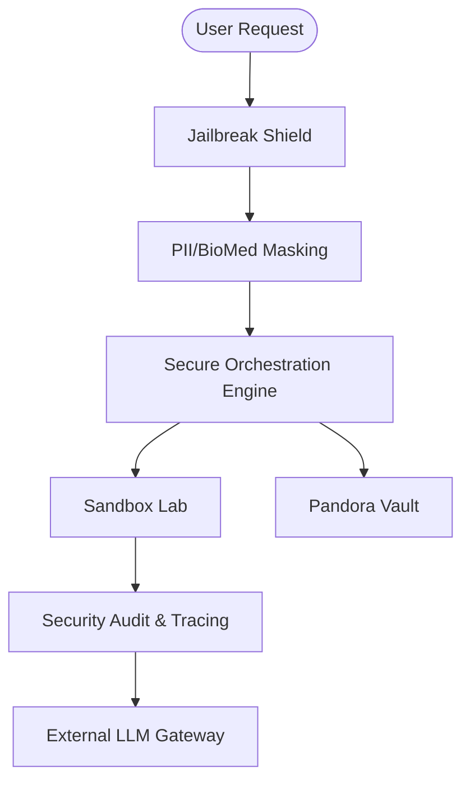

# AICCEL

AICCEL is a specialized Security Framework designed to create a protected gateway between users and Large Language Models. Its primary mission is to ensure that every AI interaction is safe, private, governed, and compliant with enterprise security standards.

---

## 1. Security Architecture Overview

Instead of directly exposing LLMs, AICCEL intercepts every request through a series of security gates. This "Security-First" architecture ensures that malicious prompts are blocked, sensitive data is masked, and AI-generated code is executed in a fortified isolation layer.

---

## 2. Framework Features & Modules

### PII Masking
AICCEL provides a high-performance redaction engine that identifies and redacts sensitive information such as Names, SSNs, and Financial data before it leaves the enterprise perimeter. It utilizes a hybrid approach of semantic entity recognition and high-precision pattern matching, combined with reversible tokenization. This ensures that the AI model only reasons over non-identifiable placeholders, while the original data is seamlessly restored in the final response for authorized users.

### BioMed Masking
Specifically designed for healthcare and life sciences, this module provides HIPAA-aligned redaction for sensitive clinical and medical data. It leverages specialized transformer models to accurately identify and mask Protected Health Information (PHI) including medical conditions, drug dosages, and lab results. This allows researchers and clinicians to leverage advanced AI capabilities while maintaining strict compliance with global medical privacy regulations.

### Jailbreak Shield
The Jailbreak Shield acts as an adversarial gateway that protects the system from prompt injection and malicious AI steering attempts. It utilizes a high-confidence classification model to scan every incoming request for sophisticated patterns designed to bypass safety guardrails or reveal internal configurations. By assigning a real-time risk score to every interaction, it can automatically block high-risk prompts before they can influence the agent's core decision-making logic.

### Pandora Data Lab
Pandora Data Lab enables natural language-driven data transformation with a "zero-leak" privacy architecture. Instead of uploading raw datasets to a cloud model, the lab only shares the data schema (column names and types) to generate optimized Python processing code. This generated code is then statically validated and executed within a local secure environment, ensuring that the actual data values never leave the enterprise's controlled boundary.

### Pandora Vault
The Pandora Vault is the framework’s high-grade cryptographic core, responsible for the secure management of sensitive provider credentials and workspace secrets. It utilizes AES-256-GCM authenticated encryption and industrial-standard key derivation functions to ensure that no secret is ever stored in plain text. Access to these keys is strictly scoped and isolated, with decryption occurring only in memory at the exact moment of execution.

### Sandbox Lab
The Sandbox Lab provides a fortified, isolated environment for executing AI-generated code snippets and autonomous scripts. Every script is subjected to deep Abstract Syntax Tree (AST) inspection to block unauthorized library imports, system file access, or network calls before execution. This "padded cell" architecture prevents "Prompt-to-System" outbreaks and ensures that automated tasks are performed without risk to the surrounding host infrastructure.

### Agent Builder
The Agent Builder is a modular factory for constructing and managing specialized AI controllers with granular configuration. It allows administrators to define unique system instructions, select specific model providers, and whitelist the exact set of tools an agent can access. By providing a unified abstraction layer, it ensures that every agent operates within a defined scope of authority and adheres to established enterprise governed policies.

### Swarm
The Swarm module enables advanced multi-agent orchestration for solving complex, cross-domain queries through collaborative intelligence. It utilizes semantic routing to automatically decompose a user request into sub-tasks and dispatch them to the most qualified specialized agents. These tasks are executed in parallel with strict concurrency control, and the final results are synthesized into a single, cohesive consensus response for the end-user.
